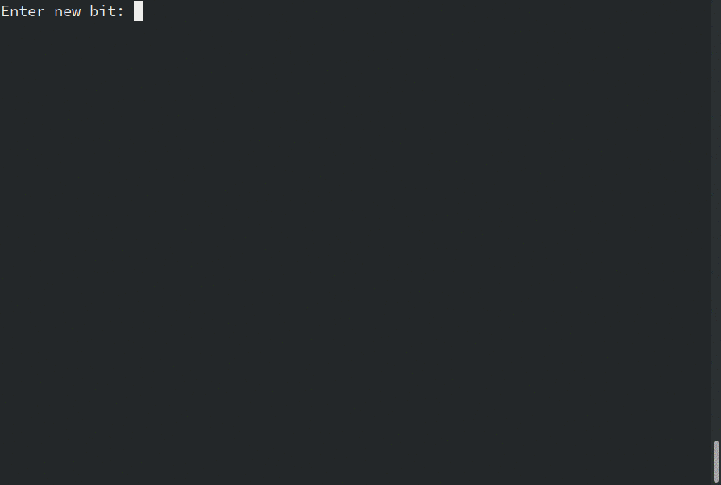

# Shannon Universal Predictor

Predicts the bit you are about to type, because hey, you are a poor entropy source ;)

Your goal is to get the lowest predictability score possible.

## Python implementation

```bash
cd src-py
python3 algorithm.py -h
# Manual game: the higher the predictor's score, the lowest is your entropy
python3 algorithm.py
# Try with random input (using Python's random module)
# this should tend to 50%
python3 algorithm.py -p random
# Or load from a file
python3 algorithm.py -p file -i example.txt
```

Demo with manual input:



## C++ implementation

```bash
cd src-cpp
g++ main.cpp -o predictor
./predictor
```
